<h1>Senior Full Stack Web Developer || AI-Powered Web & SaaS Solutions</h1>

As a Senior Full Stack Developer with over 10 years of experience, I specialize in crafting scalable, high-performance web applications and AI-powered SaaS solutions. My deep expertise spans across frontend development with React, Angular, and Next.js and backend development with Node.js, Express, PostgreSQL, Django. I am passionate about building seamless user experiences while ensuring system reliability and performance.

I am adept at leading cross-functional teams, optimizing CI/CD pipelines, and implementing microservices architecture, which enhances scalability and system resilience. With a solid foundation in cloud technologies (AWS, Azure), containerization (Docker, Kubernetes), and automated testing frameworks, I consistently drive efficiency and reduce deployment times. If you're looking for a senior-level developer to transform your ideas into high-impact, AI-driven solutions, look no further.

  

  

  

	
	
</a>

  

<table>
  <tr>
    <td></td>
    <td></td>
    <td></td>
    <td></td>
    <td></td>
    <td></td>	  
    <td></td>
    <td></td>
    <td></td>
    <td></td>
    <td></td>
    <td></td>
    <td></td>
  </tr>
  <tr>
    <td></td>
    <td></td>
    <td></td>
    <td></td>
    <td></td>
    <td></td>
    <td></td>
    <td></td>
    <td></td>
    <td></td>
    <td></td>
    <td></td>
    <td> </td>
  </tr>
</table>
